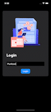

## Expense Tracker in SwiftUI
An app to manage your expenses which you will waste (just like me), used MVVM architecture.



## Persistence of Transactions
I have built a cache manager to store all the user transactions data in the memory as a cache. If you want to implement your custom class to manage them, you can do the following:
1. Create a class which conforms to the protocol `UserTransaction`.
2. Implement the functions defined inside the protocol.
```Swift
protocol UserTransaction {
    func isUserAlreadyExist(userName: String) -> Bool
    func removeUser(userName: String)
    func saveTransaction(userName: String, transactions: [Transaction])
    func getTransactions(userName: String) -> [Transaction]
    func removeTransaction(userName: String, transactions: [Transaction])
    func getUserExpenseModel(userName: String) -> UserExpenseModel?
}
```

```Swift
class YourCustomClass: UserTransaction {
    // UserTransaction Implementation
}
```

3. Pass the same class as a parameter(dependency injection) where `TransactionListViewModel` is initialized, inside the `Expense_TrackerApp.swift`.
```Swift
 @StateObject var transactionViewModel = TransactionListViewModel(userAPIDelegate: YourCustomClass())
```

### Inspiration (lol enhanced copy)
[DesignCode YT](https://youtu.be/Bu6fAlltatA)

### Packages Used
[SwiftUICharts](https://github.com/willdale/SwiftUICharts) | [SwiftUIFontIcon](https://github.com/huybuidac/SwiftUIFontIcon)
